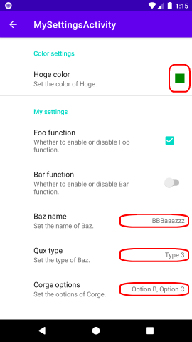
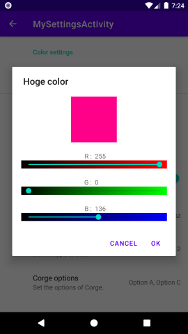
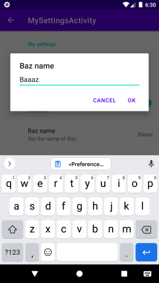
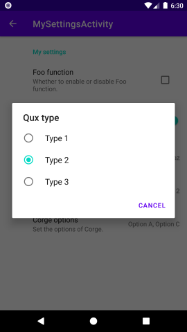
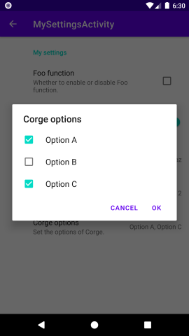
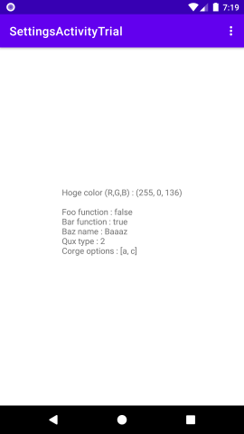

# SettingsActivityTrial
設定アクティビティを作成する方法の試行
- [設定アクティビティの作成](https://www.hiramine.com/programming/android/settingsactivity_create.html)
- [設定アクティビティのカスタマイズ](https://www.hiramine.com/programming/android/settingsactivity_custom.html)
- [設定アクティビティに設定値の表示](https://www.hiramine.com/programming/android/settingsactivity_displayvalue.html)
- [色設定プリファレンス](https://www.hiramine.com/programming/android/settingsactivity_colorpreference.html)
- [設定アクティビティに設定色の表示](https://www.hiramine.com/programming/android/settingsactivity_displaycolor.html)

このアプリの挙動としては、以下。
- アプリを起動すると、メインアクティビティが表示される。
- オプションメニューの「Settings」を選択すると、設定アクティビティに移行する。
- 設定アクティビティには、自前の設定項目が表示される。
- メインアクティビティには、自前の設定項目の設定値が表示される。
- 設定アクティビティには、「テキストを指定する設定項目」「リストから１つの項目を選択する設定項目」「リストから複数の項目を選択する設定項目」の右側に設定値が表示される。
- 設定アクティビティには、「色を設定する設定項目」が表示される。
- 「色を設定する設定項目」をタップすると色設定ダイアログが表示され、設定色を変更することができる。
- メインアクティビティには、「色を設定する設定項目」の設定値が表示される。
- 設定アクティビティの「色を設定する設定項目」の右側に設定値が表示される。

## Screenshots : スクリーンショット
<kbd></kbd> <kbd></kbd> <kbd></kbd> <kbd></kbd> <kbd></kbd> <kbd></kbd>

## Requirements : 必要条件、依存関係
- Android Studio 2020.3.1 Patch3

## Author : 作者
Nobuki HIRAMINE : [http://www.hiramine.com](http://www.hiramine.com)

## License : ライセンス
```
Copyright 2022 Nobuki HIRAMINE

Licensed under the Apache License, Version 2.0 (the "License");
you may not use this file except in compliance with the License.
You may obtain a copy of the License at

    http://www.apache.org/licenses/LICENSE-2.0

Unless required by applicable law or agreed to in writing, software
distributed under the License is distributed on an "AS IS" BASIS,
WITHOUT WARRANTIES OR CONDITIONS OF ANY KIND, either express or implied.
See the License for the specific language governing permissions and
limitations under the License.
```

